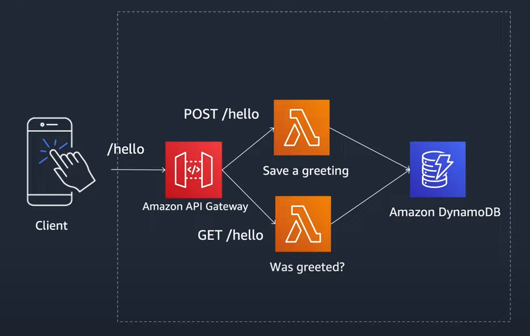

# Nodejs AWS SAM API Gateway Lambda DynamoDB &middot; 

Descripción del proyecto: Proyecto de infraestructura como código utilizando el framework AWS SAM para el desarrollo y despliegue de API Gateway, Lambda y DynamoDB.

## Arquitectura a desplegar




## Acerca de AWS y los servicios utilizados

* https://aws.amazon.com/es/serverless/sam/
* https://aws.amazon.com/es/lambda/
* https://aws.amazon.com/es/api-gateway/
* https://aws.amazon.com/es/dynamodb/

## Prerequisitos

* Instalación de Nodjes
  * https://nodejs.org/es/
* Instalación de AWS CLI
  * https://docs.aws.amazon.com/cli/latest/userguide/getting-started-install.html
* Instalación de CLI SAM
  * https://docs.aws.amazon.com/serverless-application-model/latest/developerguide/serverless-sam-cli-install.html
* Credenciales de AWS con políticas de 
  * AmazonS3FullAccess

## Configuración de credenciales

Ejecutar comando de configuración de AWS CLI para la ingresar las credenciales

```
aws configure
```

## Validar Yaml

Ejecutar comando

```
sam validate
```

## Deploy proyecto en AWS

Para desplegar aplicación en AWS

```
sam deploy --guided
```

## Equipo

Desarrollado por Diego Cortés

* dcortes.net@gmail.com

